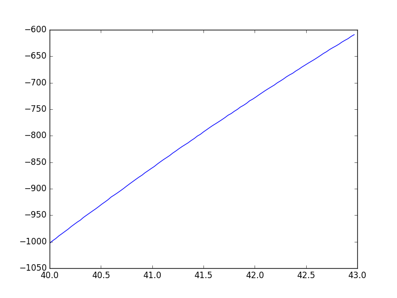

# 実験1

## 概要  
プログラムのデバッグ及び水ロケットに搭載した場合パラシュートの開傘が可能であるかどうかを確認することを目的としたシミュレーション．  
プログラムはロケットが $ y=a t^2 + bt +  c $ を基底関数とする軌道にそって飛行するとし，係数a,b,cを最小二乗法によって決定するものである．

## 実験内容

シミュレーションでは高度のデータにノイズとして±0.5mの乱数を加えた．また，実際のArduinoのプログラムではセンサーのサンプリング周期が約0.03秒であったので，それに従ってシミュレーションを行った．

## 実験結果

ケース1  

|a|頂点時間|開始時間|時間間隔|データの個数|推定されたa|推定された頂点時間|
|------:|------:|------:|------:|------:|------:|------:|
|-4.90|25.00|20.00|0.03| 10|0.66|-17.99|
|-4.90|25.00|20.00|0.03| 30|11.88|18.57|
|-4.90|25.00|20.00|0.03| 50|3.09|14.00|
|-4.90|25.00|20.00|0.03|500|-4.90|25.00|

ケース2  

|a|頂点時間|開始時間|時間間隔|データの個数|推定されたa|推定された頂点時間|
|------:|------:|------:|------:|------:|------:|------:|
|-4.90|25.00|15.00|0.03| 10|4.18|3.44|
|-4.90|25.00|15.00|0.03| 30|204.83|15.21|
|-4.90|25.00|15.00|0.03| 50|1.47|-15.06|
|-4.90|25.00|15.00|0.03|100|-3.04|30.21|
|-4.90|25.00|15.00|0.03|500|-4.90|25.00|

ケース3  

|a|頂点時間|開始時間|時間間隔|データの個数|推定されたa|推定された頂点時間|
|------:|------:|------:|------:|------:|------:|------:|
|-4.90|55.00|40.00|0.03| 10|2.51|11.14|
|-4.90|55.00|40.00|0.03| 30|2.49|11.74|
|-4.90|55.00|40.00|0.03| 50|-10.41|47.42|
|-4.90|55.00|40.00|0.03|100|0.08|-769.40|
|-4.90|55.00|40.00|0.03|500|-4.95|54.93|

## 考察

データの個数が100個以下では，ケースによっては推定された頂点時間が大幅に異なってるという結果が出た．  
これは，制約がゆるいため，与えられたデータでは放物線が正しく推定できなかったと思われる．
非常にかけ離れた頂点時間を推定した，ケース3を詳しく見てみる．
ケース3において，データの個数が100のときのものをプロットすると以下のようになる．

データの取得時間が時間が短いため，ほとんど直線となっている．したがってこのグラフから上に凸であるか，下に凸であるかや，頂点を過ぎた後なのか前なのかをグラフから読み取ることは困難であり，そういった経緯から妥当な計算結果が得られなかったことが推定される．  

水ロケットの飛行時間は長くはないため，今回のモデルは不適切であった．正常に開傘させるにはより制約の強いモデルを採用するべきである．
